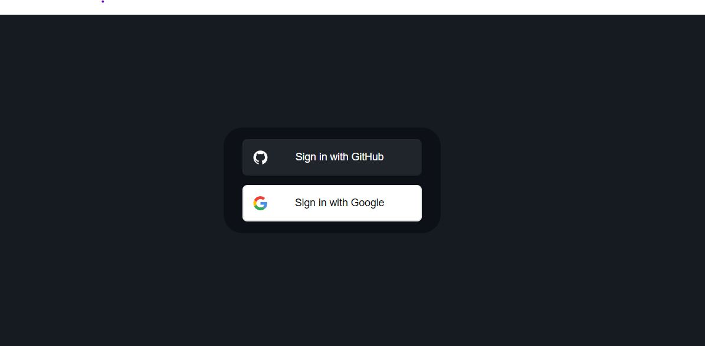

## Next.js Authentication App

#### This Next.js authentication app provides login functionality using Google and GitHub accounts. It includes server-side authentication middleware, protected routes, and client-side session handling.


### 🔍 Features 
```  console
 Login with Google and GitHub
 Protected routes based on user roles
 Server-side and client-side session management
 Middleware for route authorization
```

### 🚀 Technologies Used 
```  console
 Next.js
 NextAuth.js
 OAuth 2.0 (Google and GitHub)
 React
 Node.js
```
### 👨‍💻 PrerequisitesBefore setting up the project, make sure you have the following:
```  console
 Node.js installed on your machine
 Google and GitHub developer accounts with OAuth credentials
```

### 🔐 Getting Started
### Follow these steps to set up and run the project locally:

#### 01. Clone the repository:
```jsx harmony
git clone https://github.com/Mahesh-Abeykoon/nextjs-auth-app.git

```
#### 02. Navigate to the project directory:
```jsx harmony
cd nextjs-auth-app
```

#### 03. Install dependencies:
```jsx harmony
npm install

```

#### 04.Set up environment variables:
#### *Create a .env.local file in the root directory and add the following:

```jsx harmony
GITHUB_CLIENT_ID=your-github-client-id
GITHUB_CLIENT_SECRET=your-github-client-secret
GOOGLE_CLIENT_ID=your-google-client-id
GOOGLE_CLIENT_SECRET=your-google-client-secret
NEXTAUTH_SECRET=your-nextauth-secret

```

```jsx harmony
Replace your-github-client-id,
your-github-client-secret, 
your-google-client-id,
your-google-client-secret,
and your-nextauth-secret 
with your actual credentials.
```


#### 05. Run the developement Server:
```jsx harmony
npm run dev
```
### Open your browser and navigate to: 
```jsx harmony
http://localhost:3000 
```
### 🛡️Usage
#### Server-side Middleware
> The provided middleware (middleware.js) checks for user roles and redirects unauthorized users. You can customize the middleware to fit your application's requirements.

#### Protected Routes
> Protected routes are defined using withAuth HOC, ensuring that only authenticated users can access certain pages.

#### Client-side Session Handling
> Client-side session management is implemented using next-auth/react package. You can access the user's session data in your components as needed.

#### OAuth Providers
> This app supports authentication with Google and GitHub. Make sure to configure OAuth credentials in your developer accounts and update the environment variables accordingly.

#### Contributing
> Contributions are welcome! Fork the repository, make your changes, and submit a pull request.

#### License
> This project is licensed under the MIT License. See the LICENSE file for details.


